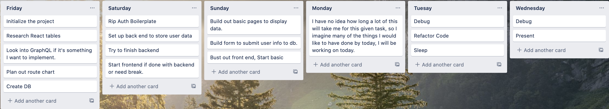
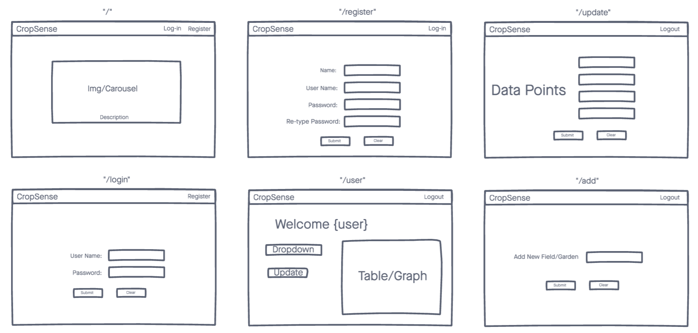

### Project 4 - Crop Sense

App: Crop Sense
Name: Scott McLeod
New Tech: React-Bootstrap-Table or maybe D3.js. I need to look more at D3.

1. I plan on learning/implementing the new technology by going through the docs and examples. I will watch tutorials if necessary. I want the data to be displayed in an easy to read and meaningful way.
2. My goal with this project is to create an app where the user would have the ability to enter data for care of their farm/garden/yard in order to be able to monitor progress and develop future care plans.
3. The user for my app could be anyone ranging from a backyard gardener to a farmer. Anyone who would like to be able to have data points to track progress.
4. Potential roadblocks that I can currently see include still not being super comfortable with React, and also finding a way in which to display the information I plan on displaying in a way that clearly shows a correlation between care and progress.

## Trello:

## WireFrames: 

## User Flow
With this app I would like to create an opportunity for the user to be able to take charge of their plant/crop growing endeavor, and be able to keep track of important metrics that, if tracked and accounted for would be able to help improve crop quality, and yield. After creating an account and signing in, the user will have the opportunity to create a list of different "locations" where they would like to monitor. An individual gardening in their back yard could use this app to enter type of crop, frequency of watering, amount of water, fertilizer schedules, as well as temperature, in order to be able to track more closely the growth of their garden, and use this information to formulate plans for future planting.